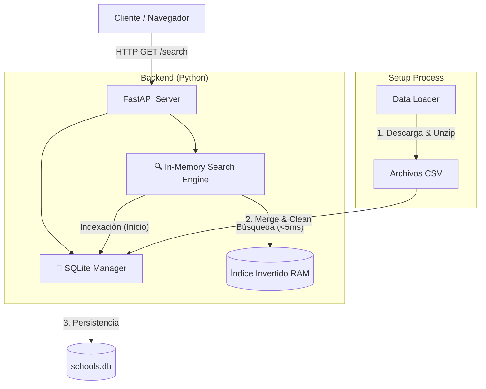

# Solución de Búsqueda de Escuelas (FastAPI + In-Memory Search Engine)

Esta solución proporciona una API de búsqueda de alto rendimiento (<5ms) para datos de escuelas de EE.UU., construida con **FastAPI** y un **Motor de Búsqueda en Memoria** personalizado.

## 🚀 Cómo Iniciar

La aplicación está contenerizada con Docker para facilitar el despliegue.

### Prerrequisitos
- Docker Desktop instalado y corriendo.

### Pasos

1.  **Construir y Correr**:

    ```bash
    docker-compose up --build
    ```

    *Nota: Si el puerto 8000 está ocupado, puedes especificar otro puerto (ej. 8080) así:*

    ```bash
    PORT=8080 docker-compose up --build
    ```
    *Importante: Los logs de la terminal seguirán mostrando "Uvicorn running on http://0.0.0.0:8000" (puerto interno del contenedor), pero podrás acceder desde tu navegador en el puerto que definiste (ej. 8080).*

2.  **Acceder a la Interfaz**:
    Abre tu navegador en: [http://localhost:8000](http://localhost:8000) (o el puerto que hayas elegido).
    
3.  **Configuración Inicial (Setup)**:
    - Al abrir la página por primera vez, verás el dashboard de estado.
    - Haz clic en **"Start Setup"**.
    - La aplicación descargará, descomprimirá y procesará automáticamente los archivos CSV de NCES.
    - Verás una barra de progreso que llena la base de datos (SQLite) y luego construye el índice de búsqueda en memoria.

## ✅ Cómo Probar la Solución

### Prueba de Búsqueda (Frontend)
Usa la barra de búsqueda en `http://localhost:8000`.
- **Latency Check**: Debajo de la barra de búsqueda verás dos tiempos:
    - **Server**: El tiempo real de procesamiento del algoritmo (debe ser < 5ms).
    - **Total**: El tiempo de ida y vuelta de red.
    
Queries de prueba sugeridos:
*   `foley` (Búsqueda simple)
*   `granada charter school` (Intersección compleja optimizada)
*   `riverside school 44` (Búsqueda mixta con números)
*   `jefferson belleville` (Búsqueda multicriterio)

### Prueba de Rendimiento (Terminal)
Puedes verificar la latencia cruda del servidor usando `curl`:
```bash
# Debe responder en < 5ms (header x-server-time-ms)
curl -v "http://localhost:8000/search?query=riverside%20school%2044&limit=3"
```

## 🏗 Arquitectura

La solución utiliza una arquitectura híbrida donde SQLite sirve como almacenamiento persistente ("source of truth") y un Índice Invertido en Memoria proporciona la velocidad de búsqueda.



### Algoritmo de Búsqueda
El motor utiliza varias optimizaciones para lograr la velocidad requerida:
1.  **Índice Invertido**: Mapeo de tokens a IDs de escuelas.
2.  **Intersección Optimizada**:
    - Ordena los tokens por frecuencia (del más raro al más común).
    - Inicia con el set más pequeño para minimizar operaciones.
    - **Adaptive Skip**: Si un término es muy común (ej. "School") y ya tenemos pocos candidatos, se salta la intersección costosa y se delega al scoring.
3.  **Top-K Heap**: Usa `heapq.nsmallest` para mantener solo los 3 mejores resultados durante el scoring, evitando ordenar toda la lista.
4.  **Smart Fallback**: Si la búsqueda "AND" (precisa) no da resultados, hace un fallback a "OR" pero excluyendo términos de alta frecuencia para evitar saturación.

## 📁 Estructura del Proyecto
- `main.py`: Punto de entrada de FastAPI.
- `services/search_engine.py`: Lógica del motor de búsqueda (Core).
- `services/data_loader.py`: Procesamiento de CSVs.
- `services/setup_service.py`: Gestión de descarga y preparación.
- `static/index.html`: Dashboard frontend.

---
**Nota**: El archivo `LEEME.md` fue generado por el asistente como parte de la entrega final.
